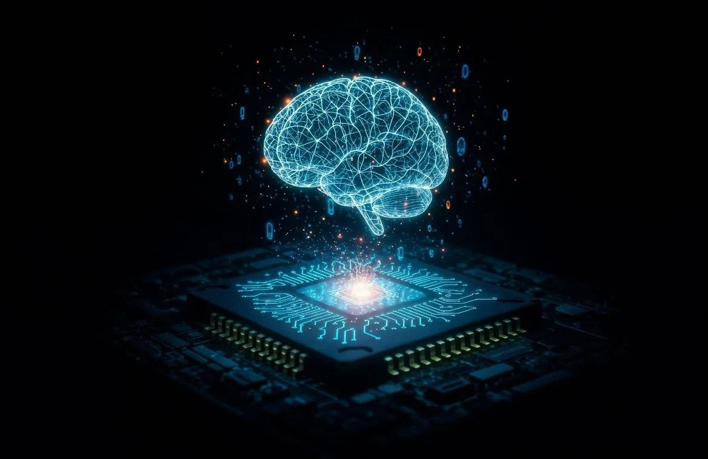

# Deep Learning

  

  A comprehensive technical exploration of Deep Learning,
  neural network architectures, and AI applications
  in cheminformatics and drug discovery.

# Deep Learning

A comprehensive technical exploration of Deep Learning fundamentals, neural network architectures, graph neural networks, optimization, and applications in cheminformatics and drug discovery.

---

## 📌 Overview

This repository contains a structured technical exploration of Deep Learning, covering the mathematical foundations, learning mechanisms, neural network architectures, and modern deep learning approaches.

The repository is designed to progress from fundamental concepts to advanced architectures, with a long-term focus on applications in Cheminformatics, Molecular Modeling, ADMET Prediction, and AI-driven Drug Discovery.

---

## 🧠 Deep Learning Fundamentals

The first part of the repository covers the core concepts required to understand how neural networks learn.

| No. | Topic |
|---|---|
| 01 | [Introduction to Deep Learning](./01_Introduction_To_Deep_Learning.ipynb) |
| 02 | [Perceptron](./02_Perceptron.ipynb) |
| 03 | [Activation Functions](./03_Activation_Functions_In_Deep_Learning.ipynb) |
| 04 | [Forward Propagation](./04_Forward_Propagation_In_Neural_Network.ipynb) |
| 05 | [Loss Function](./05_Loss_Function_In_Deep_Learning.ipynb) |
| 06 | [Backpropagation](./06_Backpropagation.ipynb) |
| 07 | [Gradient Descent](./07_Gradient_Descent.ipynb) |
| 08 | [Epoch, Batch & Iteration](./08_Epoch_Batch_Iteration.ipynb) |
| 09 | [Optimizers](./09_Optimizers.ipynb) |
| 10 | [Overfitting & Underfitting](./10_Overfitting_and_Underfitting.ipynb) |
| 11 | [Regularization](./11_Regularization.ipynb) |
| 12 | [Batch Normalization](./12_Batch_Normalization.ipynb) |
| 13 | [Model Evaluation](./13_Model_Evaluation.ipynb) |

---

## 🏗️ Neural Network Architectures

The second part explores major neural network architectures and the problems they were developed to address.

| No. | Architecture |
|---|---|
| 14 | [Artificial Neural Network (ANN)](./14_Artificial_Neural_Network_(ANN).ipynb) |
| 15 | [Convolutional Neural Network (CNN)](./15_Convolutional_Neural_Network_(CNN).ipynb) |
| 16 | [Recurrent Neural Network (RNN)](./16_Recurrent_Neural_Network_(RNN).ipynb) |
| 17 | [Long Short-Term Memory (LSTM)](./17_Long_Short-Term_Memory_(LSTM).ipynb) |
| 18 | [Gated Recurrent Unit (GRU)](./18_Gated_Recurrent_Unit_(GRU).ipynb) |
| 19 | [Attention Mechanism](./19_Attention_Mechanism.ipynb) |
| 20 | [Transformer Architecture](./20_Transformer_Architecture.ipynb) |

---

## 🔗 Graph Deep Learning

Graph-based deep learning will be explored as an important branch for representing structured data and molecular systems.

Planned topics include:

- Graph Neural Networks (GNN)
- Graph Convolutional Networks (GCN)
- Graph Attention Networks (GAT)
- GraphSAGE
- Molecular Graph Learning

---

## ⚙️ Training & Optimization

Future topics will include:

- Learning Rate
- Learning Rate Scheduling
- Weight Initialization
- Hyperparameter Optimization
- Advanced Optimization Techniques
- Model Evaluation & Validation

---

## 🚀 Advanced Deep Learning

Future sections will explore advanced deep learning concepts and architectures, including topics such as:

- Transfer Learning
- Autoencoders
- Variational Autoencoders
- Representation Learning
- Modern Deep Learning Architectures

---

## 🧪 Deep Learning for Cheminformatics

A major focus of this repository is the application of Deep Learning to molecular and pharmaceutical problems.

Planned applications include:

- SMILES-based Deep Learning
- Molecular Property Prediction
- QSAR Modeling
- Molecular Representation Learning
- Molecular GNNs
- ADMET Prediction
- Drug Discovery Applications

---

## 🛠️ Technologies

The repository uses Python and commonly used scientific and machine learning tools, including:

- Python
- NumPy
- Pandas
- Matplotlib
- Scikit-learn
- TensorFlow / Keras
- PyTorch
- RDKit

---

## 📚 Learning Approach

Each topic is explored from both a conceptual and technical perspective, including where appropriate:

- Definitions and fundamental concepts
- Mathematical foundations
- Intuition and visual explanations
- Python implementations
- Model behavior and interpretation
- Advantages and limitations
- Applications to molecular and pharmaceutical data

---

## 🗺️ Roadmap

The repository will progressively expand from fundamental Deep Learning concepts toward advanced architectures and domain-specific applications.

`
- Deep Learning Fundamentals
- Neural Network Architectures
- Graph Deep Learning
- Training & Optimization
- Advanced Deep Learning
- Deep Learning for Cheminformatics
- AI-driven Drug Discovery

---
## 🎯 Long-Term Direction
The long-term objective is to develop a strong technical foundation in Deep Learning and apply these concepts to problems in:
Cheminformatics → Molecular Modeling → QSAR → ADMET → Drug Discovery

---

## 👤 Author
Kiran Malvankar

Technical focus:

Cheminformatics | Machine Learning | Deep Learning | AI-driven Drug Discovery
